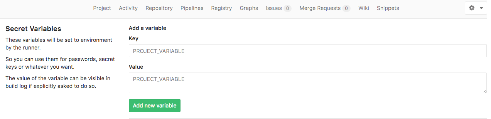

# gitlab-ci-example
Python project example files showing my approach of build/test in gitlab-ci

Samle files used as examples in my posts:


* [How to build and test docker images in gitlab-ci](http://blog.lwolf.org/post/How-to-build-and-test-docker-images-in-gitlab-ci/)
* [How to speed up builds and save time and money](http://blog.lwolf.org/post/how-to-speed-up-builds-and-save-time-and-money/)


# Some clarifications about .gitlab-ci.yaml

*/home/core/deployment-config* is a usual kubernetes config with contexts for staging and production.

```
    apiVersion: v1
    clusters:
    - cluster:
        certificate-authority-data:
        server: https://production-kubernetes-url:443
      name: production
    - cluster:
        certificate-authority-data:
        server: https://staging-kubernetes-url:443
      name: staging
    contexts:
    - context:
        cluster: production
        user: admin
      name: production-admin
    - context:
        cluster: staging
        user: admin
      name: stating-admin
    current-context: staging
    kind: Config
    preferences: {}
    users:
    - name: staging-admin
      user:
        client-certificate-data:
        client-key-data:
    - name: production-admin
      user:
        client-certificate-data:
        client-key-data:
```

*$REGISTRY_PASSWORD* is a variable set in gitlab's project variables section

